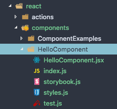
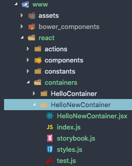

# AppSeed Style Guide


## Links

* [Airbnb Javascript Styleguide](https://github.com/airbnb/javascript/tree/es5-deprecated/es5)
* [Airbnb React Styleguide](https://github.com/airbnb/javascript/tree/master/react)

---

## Goal

---

* Create a scalable/predictable workflow
*

---

## Components

---

### Basic Rules

* Only include one React component per file.
  * However, multiple [Stateless, or Pure, Components](https://facebook.github.io/react/docs/reusable-components.html#stateless-functions) are allowed per file.
* Always use JSX syntax.
* Do not use `React.createElement` unless you're initializing the app from a file that is not JSX.

### A couple of words on STATE

* State can be a miss leading term, especially in that there can be "state" for the redux store and there can also be "state" for component
* The term gets used alot in web development right now
* Think of "component state" as something that changes to only the elements inside that component

### When to use state and when to use props?

* It's best to have a "container component" that connects to the redux store & pass down props to it's child components

### Styling Components

* The global styles can be found in the ./www/sass/global.scss
* The unique changes get done in the component folder in the ./styles.js

```

```

### Naming

* **Extensions**: Use `.jsx` extension for React components.
* **Filename**: Use PascalCase for filenames. E.g., `ReservationCard.jsx`.
* **Reference Naming**: Use PascalCase for React components and camelCase for their instances.

  ```jsx
  // bad
  import reservationCard from "./ReservationCard";

  // good
  import ReservationCard from "./ReservationCard";

  // bad
  const ReservationItem = <ReservationCard />;

  // good
  const reservationItem = <ReservationCard />;
  ```

- **Component Naming**: Use the filename as the component name. For example, `ReservationCard.jsx` should have a reference name of `ReservationCard`. However, for root components of a directory, use `index.jsx` as the filename and use the directory name as the component name:

  ```jsx
  // bad
  import Footer from "./Footer/Footer";

  // bad
  import Footer from "./Footer/index";

  // good
  import Footer from "./Footer";
  ```

- **All Other Nodejs files**: Use kebab-case for naming all other nodejs files:

  ```js
  // bad
  ./myAwesomeNodeFile.js

  // bad
  ./MyAwesomeNodeFile.js

  // good
  ./my-awesome-node-file.js
  ```

- **Importing kebab-case files**: When importing a Nodejs file that has the kebab-case file name import it as camelCase:

  ```js
  // bad
  import my-awesome-node-file from "./my-awesome-node-file";

  // good
  import myAwesomeNodeFile from "./my-awesome-node-file";
  ```

- **Try to leverage ./index.js as much as possible**:

### Types of components

1. Function based component

   * These are to be used if you don't need a local state for the component
   * e.g. ./www/react/components/ComponentExamples/FunctionCompoment.jsx

   ```jsx
   import React from "react";
   import PropTypes from "prop-types";

   const FunctionComponent = props => {
     return (
       <div className="container">
         <h3>Function Component</h3>
         <p>{props.message}</p>
       </div>
     );
   };

   FunctionComponent.propTypes = {
     message: PropTypes.string
   };
   FunctionComponent.defaultProps = {
     message: "World"
   };
   export default FunctionComponent;
   ```

2. Class based component

   * You have the options of props & state
   * e.g. ./www/react/components/ComponentExamples/ClassComponent.jsx

   ```jsx
   import React from "react";
   import PropTypes from "prop-types";
   class ClassComponent extends React.Component {
     constructor(props) {
       super(props);
     }
     render() {
       return (
         <div className="container">
           <h3>Class Component!</h3>
           <p>{this.props.message}</p>
         </div>
       );
     }
   }

   ClassComponent.propTypes = {
     message: PropTypes.string
   };
   ClassComponent.defaultProps = {
     message: "World"
   };
   export default ClassComponent;
   ```

### Components vs Containers

**Component:**

* Components receive their data via props
* e.g. ./www/react/components/StyleComponents/

  ```jsx
  import React, { Component } from "react";
  import PropTypes from "prop-types";

  class Users extends Component {
    constructor(props) {
      super(props);
    }
    render() {
      const users = this.props.users.map(item => {
        return (
          <li key={item.id}>
            <b>name: </b>
            <span>{item.name}</span>,
            <b> city: </b>
            <span> {item.city}</span>
          </li>
        );
      });
      return (
        <div>
          <h3>Users</h3>
          <ul>{users}</ul>
        </div>
      );
    }
  }
  Users.propTypes = {
    users: PropTypes.array
  };
  export default Users;
  ```

**Container:**

* containers connect to redux store to get data to pass to their children components
* e.g. ./www/react/containers/MyContainer/

  ```jsx
  import React, { Component } from "react";
  import PropTypes from "prop-types";
  import { connect } from "react-redux";

  import UserList from "../../components/UserList";
  import { fetchAllUsers } from "../../actions/users";

  class MyContainer extends Component {
    render() {
      return (
        <div>
          <p>user: {this.props.currentUser}</p>
          <UserList users={this.props.users} getUsers={this.props.getUsers} />
        </div>
      );
    }
  }

  MyContainer.propTypes = {
    currentUser: PropTypes.string.isRequired,
    users: PropTypes.array.isRequired,
    getUsers: PropTypes.func.isRequired
  };
  const mapStateToProps = state => ({
    currentUser: state.currentUser,
    users: state.users
  });
  const mapDispatchToProps = dispatch => ({
    getUsers: () => dispatch(fetchAllUsers())
  });
  export default connect(mapStateToProps, mapDispatchToProps)(MyContainer);
  ```

---

## Storybook

---

* All you have to do is:

1. Create a ./storybook.js beside your component

   ```jsx
   import { storiesOf } from "@storybook/react";
   import { action } from "@storybook/addon-actions";
   import { withInfo } from "@storybook/addon-info";
   import { withKnobs, text, boolean, number } from "@storybook/addon-knobs";
   import { setConsoleOptions } from "@storybook/addon-console";

   import React from "react";
   import Component from "./index.js";

   setConsoleOptions({
     panelExclude: [/[HMR]/]
   });

   //----ALL YOU HAVE TO DO IS UPDATE THIS OBJECT'S PROPERTIES------------------
   const Info = {
     componentSection: "Components",
     title: "Style Components",
     about: "This is a simple component to show how to style components...",
     props: {
       message: "message passed",
       handleClick: action("[Style Components] - click")
     }
   };
   // ---------------------------------------------------------------------------

   storiesOf(Info.componentSection, module)
     .addDecorator(withKnobs)
     .add(
       Info.title,
       withInfo(Info.about)(() => <Component {...Info.props} />)
     );
   ```

2. Import that storybook file in ./.storybook/config.js

   ```JS
   import { configure } from '@storybook/react';

   function loadStories() {
     require("babel-polyfill");
     require('../www/sass/global.scss');
     require("../www/react/components/StyleComponents/storybook.js"); // add your story
   }

   configure(loadStories, module);
   ```

---

## Redux

---

* It is recomented that you define the initial state of the store inside each reducer instead of in a constants file
* Don't define the entire state tree in one place and pass it into the createStore
* It is ok to hydrating persistent data to the store because it was obtain from redux itself so it doesn't break incapsulation of reducers
* we are using "redux-session-storage-gatorade" as middleware to save and hydrate the store if the user refreshes the browser
* Redux actions return a plain object, but we have installed redux-thunk that will allow us to pass in functions as well

* folders:

  ```
  ./actions/
  ./reducers/
  ./middleware/
  ./store/
  ```

* ./store/index.js

  ```js
  import { createStore, applyMiddleware } from "redux";
  import thunk from "redux-thunk";
  import logger from "redux-logger";
  import { composeWithDevTools } from "redux-devtools-extension";
  import { hydrateState, gatorade } from "redux-session-storage-gatorade";

  import reducer from "../reducers";

  const store = createStore(
    reducer,
    hydrateState(),
    composeWithDevTools(applyMiddleware(thunk, logger, gatorade))
  );
  export default store;
  ```

### Redux - updating the store with object action

* [NOTE] We should probably use [immutable.js](https://redux.js.org/docs/recipes/UsingImmutableJS.html) for this
* ./actions/action-types.js

  ```js
  /**
   * USER
   */
  export const CURRENT_USER = "CURRENT_USER";
  ```

* ./actions/current-user.js

  ```js
  import { CURRENT_USER } from "./action-types";

  // Action creator return a plain object
  const getCurrentUser = newData => ({
    type: CURRENT_USER,
    payload: newData
  });
  export default getCurrentUser;
  ```

- ./reducers/current-user/index.js

  * [NOTE] there is a reason for having folders, we can have nested combined reducers

  ```js
  import { CURRENT_USER } from "../../actions/action-types";

  export default (state = "", action) => {
    switch (action.type) {
      case CURRENT_USER:
        return action.payload;
      default:
        return state;
    }
  };
  ```

- ./reducers/index.js

  ```js
  import { combineReducers } from "redux";
  import currentUser from "./current-user";

  export default combineReducers({
    currentUser
  });
  ```

### Redux - Async

* ./actions/action-types.js

  ```js
  /**
   * USER
   */
  export const CURRENT_USER = "CURRENT_USER";

  /**
   * API
   */
  export const GET_ALL_USERS = "GET_ALL_USERS";
  export const SET_ALL_USERS = "SET_ALL_USERS";
  export const GET_ALL_USERS_ERROR = "GET_ALL_USERS_ERROR";
  ```

* ./actions/users.js

  ```js
  import axios from "axios";
  import {
    GET_ALL_USERS,
    SET_ALL_USERS,
    GET_ALL_USERS_ERROR
  } from "../actions/action-types";

  import config from "../../../appseed.config";
  const BASE_URL = config.baseUrl;

  export const requestUsers = () => ({
    type: GET_ALL_USERS
  });

  export const receiveUsers = payload => ({
    type: SET_ALL_USERS,
    payload
  });

  export const requestUsersError = () => ({
    type: GET_ALL_USERS_ERROR
  });

  // Action creator return a dispatch function - thunk
  export const fetchAllUsers = () => dispatch => {
    dispatch(requestUsers());
    const URL = `${BASE_URL}/users`;
    console.log("[URL]", URL);

    // Using the bakedin nodejs way
    // return fetch(URL)
    //   .then(response => response.json())
    //   .then(json => {
    //     dispatch(receiveUsers(json));
    //   });

    // Axios way
    return axios.get(URL).then(response => {
      if (response.status === 200) {
        dispatch(receiveUsers(response.data));
      } else {
        dispatch(requestUsersError());
      }
    });
  };
  ```

* ./reducers/users/index.js

  ```js
  import { SET_ALL_USERS } from "../../actions/action-types";

  export default (state = [], action) => {
    switch (action.type) {
      case SET_ALL_USERS:
        return action.payload;
      default:
        return state;
    }
  };
  ```

* ./reducers/index.js

  ```js
  import { combineReducers } from "redux";
  import currentUser from "./current-user";
  import users from "./users";

  export default combineReducers({
    currentUser,
    users
  });
  ```

* Connecting a Container Component to the redux store

  ```jsx
  import React, { Component } from "react";
  import PropTypes from "prop-types";
  import { connect } from "react-redux";

  import UserList from "../../components/UserList";
  import { fetchAllUsers } from "../../actions/users";

  class MyContainer extends Component {
    render() {
      return (
        <div>
          <p>user: {this.props.currentUser}</p>
          <UserList users={this.props.users} getUsers={this.props.getUsers} />
        </div>
      );
    }
  }

  MyContainer.propTypes = {
    currentUser: PropTypes.string.isRequired,
    users: PropTypes.array.isRequired,
    getUsers: PropTypes.func.isRequired
  };
  const mapStateToProps = state => ({
    currentUser: state.currentUser,
    users: state.users
  });
  const mapDispatchToProps = dispatch => ({
    getUsers: () => dispatch(fetchAllUsers())
  });
  export default connect(mapStateToProps, mapDispatchToProps)(MyContainer);
  ```

---

## Testing - Jest

---

* ...

---

## AppSeed - CLI

---

### new-component

* There is command to scafold out a new component in a folder base stucture

```
$ appseed new component
```

* This will create all the nessesary files

  

### new-container

* There is command to scafold out a new container in a folder base stucture

```
$ appseed new container
```

* This will create all the nessesary files

  

### new-reducer

---

## Prettier

---

* auto format code on save
* ESLint is not a formatter it's a linter for finding semantics and errors
* Consistency in code formatting across your code base
* Teachability
* dont think write code
